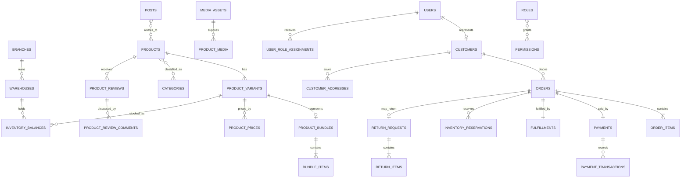

# V1 model và quan hệ — bản review

File nguồn ERD: `09-v1-model.dbml`. Copy toàn bộ nội dung vào dbdiagram.io để xem và kéo thả sơ đồ.

## Quyết định phạm vi kho V1

Kho V1 được chốt ở mức cơ bản:

- Quản lý tồn theo `warehouse + product_variant + quantity`.
- Có balance, ledger, reservation checkout và điều chỉnh tồn có lý do/audit.
- Chưa quản lý serial/IMEI hoặc từng đơn vị thiết bị.
- Chưa quản lý supplier, purchase order và goods receipt.
- Hàng đầu kỳ/nhập bổ sung được ghi qua stock adjustment có loại nghiệp vụ và chứng từ tham chiếu.
- Stocktake và transfer giữ ở P1, chỉ bật sau khi luồng bán hàng cơ bản ổn định.

Quyết định này không bổ sung bảng serial/procurement. Các bảng mới trong lần review này thuộc media, review/comment và CMS. Khi lên V2 phải bổ sung nghiệp vụ nhập hàng trước khi triển khai kế toán giá vốn nâng cao.

## 1. Quy mô model

| Nhóm | P0 | P1 | Nhận xét |
|---|---:|---:|---|
| Organization + IAM + Approval | 9 | 1 | Approval chỉ cần khi bật refund/threshold stock/price |
| Customer | 2 | 0 | Customer tách User để hỗ trợ guest checkout |
| External media | 1 | 1 | Asset provider dùng chung; không lưu binary trong DB |
| Catalog + Pricing + Review + Flash sale + Combo | 10 | 10 | Product/Variant là ranh giới bắt buộc; combo snapshot component |
| Inventory | 5 | 4 | Balance + ledger + reservation là core |
| Cart + Order | 6 | 0 | Order snapshot không phụ thuộc catalog sau đặt hàng |
| Payment | 3 | 1 | Một payment/order nhưng nhiều transaction |
| Fulfillment + Shipping | 5 | 0 | Một fulfillment/order ở V1 |
| Return | 0 | 3 | Phát hành sau luồng bán thường |
| CMS + Notification + Platform | 2 | 11 | Idempotency/outbox là P0; CMS taxonomy/relations thuộc P1 |
| **Tổng** | **43** | **31** | **74 bảng trong DBML** |

Model vật lý hiện có 74 bảng: 43 bảng P0 và 31 bảng P1. DBML là nguồn review kỹ thuật; catalog CSV là nguồn theo dõi phạm vi/priority.

## 2. Quan hệ lõi cần chốt



Sơ đồ trên chỉ hiển thị aggregate lõi. File DBML chứa toàn bộ 74 bảng và 155 khai báo FK đã được kiểm tra tham chiếu.

| Parent | Child | Cardinality V1 | On delete | Rule nghiệp vụ |
|---|---|---|---|---|
| `branches` | `warehouses` | 1 → 1 | RESTRICT | `warehouses.branch_id` unique; branch cần warehouse trước khi active |
| `users` | `customers` | 1 → 0..1 | SET NULL | Guest customer không cần user |
| `customers` | `customer_addresses` | 1 → n | CASCADE | Chỉ cascade master address; order giữ snapshot riêng |
| `roles` | `permissions` | n ↔ n | CASCADE junction | Xóa mapping được; role/permission code không tái sử dụng |
| `users` | `user_role_assignments` | 1 → n | RESTRICT | Assignment chứa role + scope; không nhét scope vào permission |
| `branches` | `user_role_assignments` | 1 → n optional | RESTRICT | Dùng khi scope BRANCH |
| `warehouses` | `user_role_assignments` | 1 → n optional | RESTRICT | Dùng khi scope WAREHOUSE |
| `categories` | `categories` | 1 → n self | RESTRICT | Không xóa node có con; chống cycle |
| `brands` | `products` | 1 → n optional | RESTRICT | Product có thể chưa chọn brand lúc draft |
| `products` | `product_variants` | 1 → n | RESTRICT | Product không bán trực tiếp; variant là SKU |
| `product_variants` | `product_bundles` | 1 → 0..1 | RESTRICT | Bundle variant là combo ảo, không giữ tồn riêng |
| `product_bundles` | `bundle_items` | 1 → n | CASCADE/RESTRICT | Component là variant thường; không nested combo |
| `order_items` | `order_item_components` | 1 → n với combo | RESTRICT | Snapshot component để reserve/ship/return chính xác |
| `products` | `categories` | n ↔ n | CASCADE/RESTRICT | Một product có nhiều category; một primary |
| `products` | `product_reviews` | 1 → n | RESTRICT | Review chỉ từ order item đã mua/nhận hàng |
| `product_reviews` | `product_review_comments` | 1 → n | CASCADE | Shop reply/customer follow-up; tối đa một cấp reply ở V1 |
| `media_assets` | `product_media/review/page/post/banner` | 1 → n | RESTRICT/SET NULL | Provider asset dùng lại; không xóa khi còn usage |
| `posts` | `products` | n ↔ n | CASCADE/RESTRICT | Bài viết liên quan sản phẩm và chiều ngược lại |
| `product_variants` | `product_prices` | 1 → n | RESTRICT | Price effective-dated; không overwrite lịch sử |
| `warehouses + variants` | `inventory_balances` | n ↔ n qua balance | RESTRICT | Unique warehouse+variant |
| `warehouses + variants` | `inventory_movements` | 1 → n | RESTRICT | Append-only ledger |
| `orders` | `inventory_reservations` | 1 → n | RESTRICT | Một reservation cho mỗi SKU/kho trong order |
| `carts` | `cart_items` | 1 → n | CASCADE | Cart là dữ liệu tạm; không reserve stock |
| `customers` | `orders` | 1 → n | RESTRICT | Guest checkout vẫn tạo customer record |
| `orders` | `order_items` | 1 → n | RESTRICT | Item snapshot bất biến |
| `orders` | `order_addresses` | 1 → 1 shipping | RESTRICT | Snapshot, không FK customer address |
| `orders` | `payments` | 1 → 1 | RESTRICT | Đây là giới hạn V1; V2 đổi 1 → n nếu split/retry payment aggregate |
| `payments` | `payment_transactions` | 1 → n | RESTRICT | Attempt/webhook append-only |
| `orders` | `fulfillments` | 1 → 1 | RESTRICT | Đây là giới hạn V1; V2 đổi 1 → n khi split shipment |
| `shipping_zones` | `shipping_rates` | 1 → n | RESTRICT | Rate có thể mặc định hoặc override theo branch |
| `orders` | `return_requests` | 1 → 0..1 active | RESTRICT | Chọn item/quantity; combo trả nguyên bộ |
| `return_requests` | `return_items` | 1 → n | RESTRICT | Mỗi item tham chiếu order item gốc |
| `approval_requests` | `refunds/stock_adjustments` | 1 → 0..1 mỗi loại | RESTRICT | Approval generic; payload immutable |

Lifecycle P0 sau quyết định D22:

- `branches`, `warehouses`, `users`, `roles`, `media_assets`, `brands`, `categories`, `products`, `product_variants`, `product_media` không dùng `deleted_at`.
- Bản ghi ngừng sử dụng được giữ lại bằng trạng thái rõ nghĩa: `INACTIVE` cho master/SKU/media relation và `ARCHIVED` cho product.
- Email, phone và barcode không được tái sử dụng chỉ vì bản ghi chuyển `INACTIVE`; migration dừng để xử lý thủ công nếu dữ liệu soft-delete cũ đang trùng.
- Audit log lưu actor, thời điểm và lý do của transition; transaction/ledger tiếp tục reverse/cancel, không physical delete.

## 3. Aggregate ownership

| Aggregate root | Bảng con được ghi cùng transaction | Không được ghi trực tiếp từ module khác |
|---|---|---|
| `orders` | `order_items`, `order_addresses`, `order_status_history` | Order status, totals và snapshots |
| `payments` | `payment_transactions`, `payment_evidences` | Payment status/received amount |
| `fulfillments` | `fulfillment_status_history` | Fulfillment status/timestamps |
| `inventory_balances` | `inventory_movements`, `inventory_reservations` theo command | `on_hand`, `reserved` |
| `stock_adjustments` | `stock_adjustment_items` | Adjustment status/post result |
| `stocktakes` | `stocktake_items` | Snapshot/count/variance |
| `stock_transfers` | `stock_transfer_items` | Ship/receive quantities |
| `flash_sale_campaigns` | `flash_sale_items`, quota reservations | quota counters |
| `return_requests` | `return_items` | Return decision/received state |
| `approval_requests` | Không có child generic | proposed payload và decision |

## 4. Quan hệ cố ý không tạo FK

| Cột | Lý do | Cách bảo vệ |
|---|---|---|
| `audit_logs.entity_type/entity_id` | Audit nhiều loại entity | App validation; index entity type/id; không cascade |
| `inventory_movements.reference_type/reference_id` | Movement sinh từ order/transfer/adjustment/return | Unique idempotency key và reconciliation job |
| `outbox_events.aggregate_type/aggregate_id` | Event nhiều aggregate | Ghi cùng transaction; retention policy |
| `idempotency_keys.actor_id` | Actor có thể user/system/signed guest | Actor type + signed context + expiry |
| `payment_evidences.guest_access_id` | Guest không có user | Token hash/signed access; không lưu raw secret |
| `media_usages.owner_type/owner_id` | Ảnh nhúng trong nhiều loại rich content | Validate owner khi publish; cleanup job không xóa asset còn usage |

Không dùng quan hệ polymorphic cho dữ liệu lõi cần integrity như order, payment, fulfillment, balance hoặc reservation.

## 5. Unique/check/index cần viết bằng migration PostgreSQL

DBML chỉ mô tả; migration phải bổ sung:

1. Unique `warehouses.branch_id`; một branch đúng một warehouse.
2. Partial unique `normalized_email`, `normalized_phone`, barcode khi khác null.
3. CHECK đúng cấu trúc `user_role_assignments.scope_type`.
4. Category cycle được chặn trong service/recursive validation.
5. Partial unique một default customer address/type.
6. Partial unique một primary category/product và primary media/target.
7. Exclusion constraint chống overlap `product_prices` và `shipping_rates` cùng dimension.
8. CHECK inventory `on_hand >= reserved >= 0`.
9. CHECK tất cả money/quantity không âm; movement delta và adjustment delta khác 0.
10. CHECK order totals: `grand_total = subtotal - discount_total + shipping_total`; `tax_total` đã nằm trong giá.
11. Partial unique provider + external payment event.
12. Partial unique một active return/order.
13. Index reservation `(status, expires_at)` và outbox `(status, available_at)`.
14. Index mọi FK và timeline `(aggregate_id, created_at desc)`.
15. Unique `media_assets(provider, provider_asset_id)` và checksum index để phát hiện upload trùng.
16. Review chỉ được tạo từ `order_item` đã `DELIVERED`; một review/order item.
17. Comment review V1 tối đa một cấp; chặn parent của parent.
18. Một primary content category/post và một cover/hero asset hợp lệ.

## 6. Điểm tôi đề nghị thay đổi trước khi chốt migration

### A. Giữ `customers` bắt buộc trên order

Đã chốt: guest checkout vẫn upsert/tạo customer record với `user_id=null` và normalized phone bắt buộc. Khách không bị tạo tài khoản/mật khẩu. Khi đăng ký sau, hệ thống xác minh rồi link user vào customer cũ.

### B. Không tạo `fulfillment_items` ở V1

Vì một order = một warehouse = một full fulfillment, fulfillment dùng toàn bộ `order_items`. Khi có split shipment mới thêm `fulfillment_items`; thêm sớm sẽ tăng join và trạng thái mà chưa có nghiệp vụ.

### C. Không tạo `inventory_commitments`

`inventory_reservations.status=COMMITTED` đã biểu diễn cam kết sau payment. Tạo thêm commitments sẽ có hai nguồn sự thật.

### D. Giữ payment 1–1 nhưng transaction 1–n

Đã chốt: khách thanh toán đủ một lần. Một payment aggregate quản lý attempts/manual evidence; thiếu, thừa hoặc giao dịch lặp chuyển NEED_REVIEW. Refund theo return có thể partial và không làm payment ban đầu thành split payment.

### E. P1 không nên nằm trong migration đầu

Migration Wave 1–5 chỉ tạo bảng P0. P1 được giữ trong DBML để review quan hệ và tránh thiết kế P0 chặn đường mở rộng.

## 7. Câu hỏi còn cần chủ dự án xác nhận

- Có cần bắt OTP ngay khi guest checkout hay chỉ khi tra cứu/hủy/return? Khuyến nghị chỉ OTP ở thao tác nhạy cảm.

Serial/IMEI và procurement đã được quyết định để V2. Đây không còn là blocker cho migration V1.

## 8. Quy ước nhập tồn cơ bản trong V1

`stock_adjustments` cần thêm/khóa các giá trị `adjustment_type`:

```text
OPENING_BALANCE   // tồn đầu kỳ, chỉ dùng khi khởi tạo
MANUAL_RECEIPT    // nhập bổ sung chưa qua PO
CORRECTION_IN     // sửa chênh lệch tăng
CORRECTION_OUT    // sửa chênh lệch giảm
DAMAGE_OUT        // hỏng/mất không còn bán được
```

Với `MANUAL_RECEIPT`, bắt buộc nhập `external_reference` và nên nhập `source_name` để sau này đối chiếu chứng từ. Đây chỉ là cầu nối V1, không thay thế procurement lâu dài.

Khi post adjustment:

```text
stock_adjustment POSTED
  -> inventory_balance.on_hand thay đổi
  -> inventory_movement được tạo với cùng reference
  -> audit/outbox được ghi
```

Không cho phép nhân viên sửa trực tiếp `inventory_balances.on_hand`.

## 9. Review/comment, bài viết và media bên thứ ba

### Đánh giá sản phẩm

```text
order_item DELIVERED
  -> product_review PENDING
  -> moderator APPROVED/PUBLISHED
  -> product_review_media (optional)
  -> product_review_comments (shop reply/customer follow-up)
```

- Một `order_item` chỉ có một review để bảo đảm verified purchase.
- Review có rating 1–5, nội dung, trạng thái moderation và media riêng.
- Comment/reply không làm thay đổi rating. V1 chỉ hỗ trợ một cấp reply để tránh cây comment phức tạp.
- Xóa review/comment là soft-delete hoặc trạng thái HIDDEN/REJECTED; giữ lịch sử moderation/audit.

### Bài viết và trang giới thiệu

- `pages`: nội dung tĩnh như Giới thiệu, Liên hệ, Chính sách, Hướng dẫn, landing page.
- `posts`: Tin tức, hướng dẫn tập luyện, mẹo luyện tập, bài review sản phẩm.
- `content_categories`, `content_tags`: taxonomy riêng, không dùng chung product category.
- `post_products`: gắn bài viết liên quan vào trang sản phẩm và gắn sản phẩm trong bài viết.
- CMS dùng state `DRAFT -> SCHEDULED/PUBLISHED -> ARCHIVED`; slug unique và giữ SEO metadata.

### Upload ảnh qua dịch vụ bên thứ ba

```text
Admin/Customer
  -> API xin signed upload token/preset
  -> upload trực tiếp tới provider
  -> provider trả public_id/asset_id
  -> API finalize và xác minh metadata/signature
  -> lưu media_assets
  -> tạo quan hệ product_media/review_media/page/post/banner
```

Quy tắc:

- Database không lưu binary/base64; chỉ lưu provider ID, secure URL, kích thước, checksum và metadata.
- Secret/API key của provider chỉ ở backend/secret manager, không lưu `system_settings` và không gửi ra frontend.
- Customer upload dùng preset/folder/size/MIME hạn chế; file ở trạng thái pending scan/moderation trước khi public.
- Không hard-delete provider asset nếu còn `product_media`, `product_review_media` hoặc `media_usages` tham chiếu.
- Xóa là hai bước: đánh dấu `DELETING` -> job kiểm tra usage -> gọi provider delete -> `DELETED`.
- URL transform/thumbnail sinh từ provider; không lưu nhiều bản ảnh vật lý trong DB.
- Adapter backend phải che khác biệt Cloudinary/ImageKit/S3-compatible để sau này đổi provider không sửa domain.
